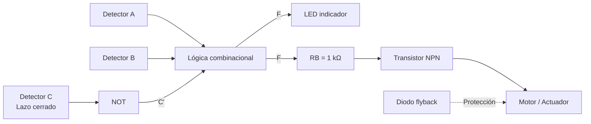

<p align="center">
  
</p>

<h1 align="center">🔥 EIC901 — Etapa 1</h1>

<p align="center">
  <strong>Sistema de extinción por votación 2 de 3</strong><br>
  Circuitos de interfaz analógica y digital
</p>

<p align="center">
  
  
  
  
</p>

---

## 📌 Descripción

Este proyecto implementa un **sistema de extinción por votación 2 de 3 con detector de lazo cerrado**.

El sistema recibe tres entradas digitales:

| Entrada | Descripción |
|---|---|
| **A** | Detector 1 — `1 = fuego` |
| **B** | Detector 2 — `1 = fuego` |
| **C** | Detector de lazo cerrado — `1 = normal`, `0 = fuego o corte del cable` |

La salida **F** determina la activación del actuador:

```text
F = 0 → Actuador desactivado
F = 1 → Actuador activado
```

---

## ⚙️ Funcionamiento general



La lógica digital genera la señal **F**, pero la salida de una compuerta lógica no alimenta directamente el actuador.

La etapa de potencia utiliza:

- transistor **BJT NPN**;
- resistencia de base de **1 kΩ**;
- diodo **flyback**;
- motor de CC como representación de una electroválvula.

---

## 🧠 Función lógica

### Función canónica

```text
F = A'BC' + AB'C' + ABC' + ABC
F(A,B,C) = Σm(2,4,6,7)
```

### Función simplificada

```text
F = AB + AC' + BC'
```

Forma factorizada utilizada en la implementación:

```text
F = AB + C'(A + B)
```

---

## 🔌 Circuito combinacional

| Integrado | Función |
|---|---|
| **74HC04** | NOT |
| **74HC08** | AND |
| **74HC32** | OR |

Señales internas:

```text
N = C'
P = AB
Q = A + B
R = C'(A + B)

F = P + R
```

---

## 🎨 Código de colores

| Color | Uso |
|---|---|
| 🔴 Rojo | Alimentación +5 V |
| ⚫ Negro | GND |
| 🟡 Amarillo | Entrada A |
| 🟢 Verde | Entrada B |
| 🔵 Azul | Entrada C |
| 🟣 Morado | Señales lógicas internas |
| 🟠 Naranja | Salida F |
| ⚪ Gris | Etapa BJT / potencia |

---

## 🔋 Interfaz BJT

La etapa de potencia utiliza un transistor NPN como **interruptor de lado bajo**.

```text
+5 V
 │
Motor
 │
Collector
 │
BJT NPN
 │
Emitter
 │
GND
```

Control de base:

```text
F → RB = 1 kΩ → Base
```

El diodo flyback se conecta en paralelo con la carga inductiva para proteger la etapa de conmutación frente a sobretensiones producidas al apagar el motor.

---

## 🧮 Cálculos eléctricos

### Corriente de base

```text
Vlogic = 5,0 V
VBE ≈ 0,7 V
RB = 1000 Ω

IB = (Vlogic - VBE) / RB
IB ≈ 4,3 mA
```

### Mediciones en Tinkercad

| Parámetro | Valor |
|---|---:|
| Voltaje lógico | 5,0 V |
| VBE aproximado | 0,7 V |
| Resistencia de base | 1 kΩ |
| Corriente de base | 4,3 mA |
| Corriente medida del motor | **79,3 mA** |
| Voltaje medido en la carga | **≈ 4,70 V** |
| Relación IC / IB | **≈ 18,4** |
| Potencia aproximada | **≈ 0,37 W** |

---

## ✅ Validación del circuito

| Prueba | A | B | C | F esperada | F obtenida | Resultado |
|---:|---:|---:|---:|---:|---:|---|
| 1 | 0 | 0 | 0 | 0 | 0 | ✅ |
| 2 | 0 | 0 | 1 | 0 | 0 | ✅ |
| 3 | 0 | 1 | 0 | 1 | 1 | ✅ |
| 4 | 0 | 1 | 1 | 0 | 0 | ✅ |
| 5 | 1 | 0 | 0 | 1 | 1 | ✅ |
| 6 | 1 | 0 | 1 | 0 | 0 | ✅ |
| 7 | 1 | 1 | 0 | 1 | 1 | ✅ |
| 8 | 1 | 1 | 1 | 1 | 1 | ✅ |

**Resultado: 8 / 8 pruebas correctas.**

---

## 📂 Documentación del proyecto

| Recurso | Ubicación |
|---|---|
| 🧮 Cálculos y pruebas | [`02_Calculos`](./02_Calculos/) |
| 🧩 Diagramas | [`03_Diagramas`](./03_Diagramas/) |
| 🔌 Archivos de Tinkercad | [`03_Diagramas/Tinkercad`](./03_Diagramas/Tinkercad/) |
| 📸 Capturas y evidencias | [`04_Capturas`](./04_Capturas/) |
| 🎥 Video de funcionamiento | [`04_Capturas/Video`](./04_Capturas/Video/) |
| 📄 Informe final | [`05_Informe`](./05_Informe/) |

---

## 🎯 Estado de la Etapa 1

- [x] Tabla de verdad analizada
- [x] Función canónica derivada
- [x] Simplificación mediante Karnaugh
- [x] Verificación mediante álgebra booleana
- [x] Circuito combinacional diseñado
- [x] Implementación con 74HC04, 74HC08 y 74HC32
- [x] Interfaz de potencia con BJT
- [x] Resistencia de base calculada
- [x] Diodo flyback implementado
- [x] Corriente del actuador medida
- [x] Ocho combinaciones comprobadas
- [x] Diagramas documentados
- [x] Evidencias y video almacenados
- [x] Informe final completado

---

## 🏁 Resultado final

> **El sistema implementa correctamente la lógica de votación 2 de 3 y controla una carga inductiva mediante una interfaz BJT, obteniendo resultados correctos en las 8 combinaciones de entrada evaluadas.**

<p align="center">
  <strong>✅ ETAPA 1 COMPLETADA</strong>
</p>
